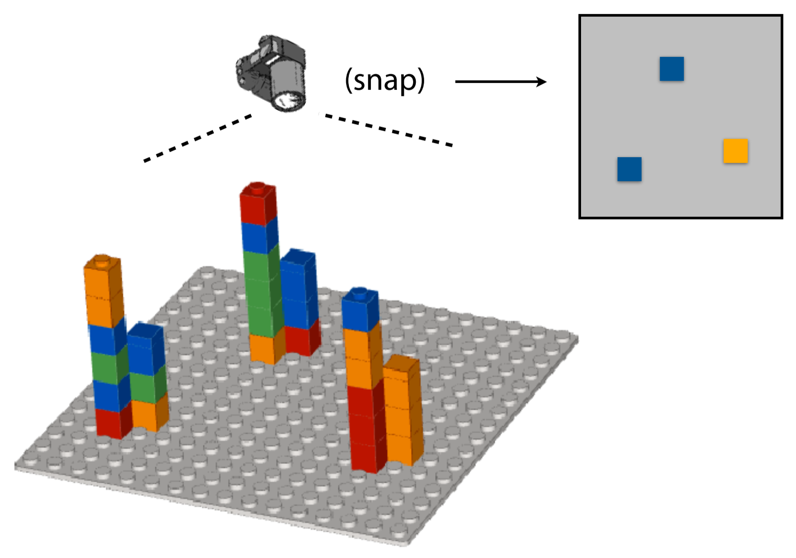

```{r setup, include=FALSE}
options(htmltools.dir.version = FALSE)
```

<script src="https://ajax.googleapis.com/ajax/libs/jquery/3.1.1/jquery.min.js"></script>
<script>
$(document).ready(function() {
  $('slide:not(.backdrop):not(.title-slide)').append('<div class=\"footnotes\">');

  $('footnote').each(function(index) {
    var text  = $(this).html();
    var fnNum = (index+1).toString();
    $(this).html(fnNum.sup());

    var footnote   = fnNum + '. ' + text + '<br/>';
    var oldContent = $(this).parents('slide').children('div.footnotes').html();
    var newContent = oldContent + footnote;
    $(this).parents('slide').children('div.footnotes').html(newContent);
  });
});
</script>

## MBP Tech Talks | Fall 2019

Fundamentals of Genome Sequencing and Applications


## Motivations

* Lots of research involves genome sequencing or and analysis
* Few resources covering the fundamentals
* Information is often scattered through blog posts, presentations
* Multidisciplinary - difficult for a single person to discuss thoroughly


## Goals for the fall semester

* Understand foundations of genome sequencing
    * How DNA is captured and read
    * What makes good sequencing data
* Sequence alignment
* Wet and dry sides of sequencing experiments
* How to think about good experiment design when sequencing


## Outline | Part 1: Fundamentals of genome sequencing

* History of reading DNA
* Massively-parallel sequencing
* Standard file formats
* Sequence alignment
* Alignment metrics
    
## Outline | Part 2: Applications of genome sequencing
    
* Mutation detection
* Chromatin accessibililty
* Histone modifications and protein binding
* Transcriptome sequencing
* Chromatin organization
* DNA methylation


## Session structure

* HSB 100, Friday 12:00 - 14:00
* No food or drinks
* Each session has 2 parts, break in the middle


# Fundamentals of DNA sequencing


## DNA molecules

<div class="columns-2">

<footnote>Alberts, Molecular biology of the cell, 6ed. pg. 176</footnote>


* DNA is double-stranded polymer
* DNA contains 4 nucleotides: adenine (A), cytosine (C), guanine (G), thymine (T)
* DNA has a sugar-phosphate backbone
* Nucleotides come in complementary pairs: A-T, C-G

</div>


## DNA molecules

<div class="columns-2">

<footnote>Alberts, Molecular biology of the cell, 6ed. pg. 177</footnote>

* DNA has a right-handed orientation
* Strands are oriented in opposite directions
* We measure direction by counting 5' to 3'

</div>

## DNA encodes information for organisms


<footnote>Alberts, Molecular biology of the cell, 6ed. pg. 178</footnote>


* Complementary strands allow for replication
* Sequences themselves code for proteins inside cells


## DNA sequencing

* Genome: set of all DNA inside an organism
* Sequencing: the process of measuring the order of these nucleotides in a set of cells


## Sanger sequencing

<div class="note">
* Just from a high level, since details aren't totally relevant, just the idea
</div>

* Gel electrophoresis
    * Small fragments of DNA are loaded into lanes of gel
    * Small electric potential pulls DNA through gel
    * Larger resistance on longer fragments
* Load polymerase, primers, and ddNTPs to template strand
    * Primers to act as substrate for polymerase
    * Polymerase to bind ddNTPs to template strand
    * Add ddNTPs one at a time to control which nucleotide gets added next

## Sanger sequencing


<footnote>Mardis, 2013</footnote>

<div class="note">
* Separate small portion after adding a particular ddNTP
    * Keep all portions after adding a given ddNTP together
    * Load these in a lane
* Bright band in the lane gives nucleotide
* Vertical position gives order in sequence
</div>


## Early DNA sequencing | Sanger sequencing

<div class="columns-2">
Pros

* Sequence DNA fragments
* Can visually see the order of nucleotides


Cons

* Limited by sharpness of bands
* Limited by length of gel
* X-ray gel exposure, image development, one nucleotide at a time (laborious)
</div>

## Early DNA sequencing | Sequencing by synthesis

* Use ideas of Sanger sequencing:
    * Primers, polymerase, nucleotides
    * Synthesize complementary strand base-by-base
* Instead of measuring all at once via gel, measure fluorescence

## Early DNA sequencing | Sequencing by synthesis


## Early DNA sequencing | Sequencing by synthesis


## Early DNA sequencing | Sequencing by synthesis


## Early DNA sequencing | Sequencing by synthesis


## Early DNA sequencing | Sequencing by synthesis


## Early DNA sequencing | Sequencing by synthesis


## Massively parallel sequencing


## Massively parallel sequencing


## Massively parallel sequencing


## Massively parallel sequencing


## Massively parallel sequencing


## Massively parallel sequencing


## Massively parallel sequencing


## Massively parallel sequencing



## Massively parallel sequencing


## Massively parallel sequencing


## Massively parallel sequencing


## Massively parallel sequencing


* Complement of captured bases to reveal the original DNA sequence
* Image of the entire slide allows simultaneous capturing of millions of fragments of DNA

# Storing DNA sequences

## FASTA format {.build}

* Sequence name
* Sequence string

```{shell}
>Name
SEQUENCE
```

```{shell}
>reference-seq-name1
ATCTATACTTTATCTTTATCTTTA
>reference-seq-name2
ATTTTATCGCGTAGCTAGCTGGCT

```

<div class="note">
* Pairs of lines are the fundamental units
* Everything encoded in plain text
</div>

## FASTA format

<div class="columns-2">
Pros

* Simple to understand
* Encodes DNA in plain letters
* Easy to parse, edit, etc


Cons

* Assumes sequences are exact
    * Often not true in practice
* Often extremely large files
    * Human genome: 3 Gbp
    * Tend to be gzipped to compress size
* No computational optimization
    * Random access
    * ASCII encoding is overkill when you only need 2 bits
</div>

## FASTQ format

<div class="note">
* Very similar to FASTA
</div>

* Sequence name
* Sequence string
* Description
* Quality scores (uncertainty in measurement)

<div class="note">
* Analogous to working with sig figs, % err in measurements
</div>

## FASTQ format | Quality scores

<div class="note">
* Consider same set of reads as before
* Fragments spread out on a substrate
* Ideally we'd be able to measure a single strand of DNA
* More robust measurements come from having clones of the same fragment
</div>


## FASTQ format | Quality scores


## FASTQ format | Quality scores


<div class="note">
* Consensus call is blue
* Not unanimous
</div>

$p = \mathbb{P}[\text{incorrect call}] = \frac{1}{9}$

## FASTQ format | Quality scores


$p = \mathbb{P}[\text{incorrect call}] = \frac{3}{9} = \frac{1}{3}$

<div class="note">
* This is a simple model for calculating errors in calls
* More complicated methods can be used to calculate $p$, based on the chemistry, the asymmetric errors, input sample base distribution, etc
</div>

## FASTQ format | Quality scores

* Modern sequencers are very accurate
* Often $p \approx 0$
* Phred quality score $q = -10\log_{10}(p)$
* $q \in [0, \infty)$,
* $q = 10 \implies p = \frac{1}{10}$
* $q = 20 \implies p = \frac{1}{100}$
* $q = 30 \implies p = \frac{1}{1000}$
* $q = 40 \implies p = \frac{1}{10000}$

## FASTQ format | Quality scores {.build}

* Encode $q$ as a single ASCII character
* ASCII(round($q$) + 33)
* $q = 0 \implies$ !
* $q = 40 \implies$ I

```{shell}
>reference-seq-name1
ATCTATACTTTATCTTTATCTTTA
+
GFFFFBBBCBCCBBAAA:::;;;;
>reference-seq-name2
ATTTTATCGCGTAGCTAGCTGGCT
+
FFFEEBBBCBCCBBAAA:::;;;;
```

## DNA sequencing data is full of errors

* Say you have 1000 fragments, each 100 bp long, each base has $q = 40$
* What is the probability you have no errors anywhere in your data?

## DNA sequencing data is full of errors

* $\mathbb{P}[\text{no errors}]$
* $(\mathbb{P}[\text{no errors in read}])^{1000}$
* $((1-\mathbb{P}[\text{incorrect base call}])^{100})^{1000}$
* $(1-p)^{100000} \approx 4.54 \cdot 10^{-5}$

* $\mathbb{E}[\text{incorrect base calls}] \approx np = 100000 \cdot \frac{1}{10000} = 10$

## DNA sequencing data is full of errors


## Sequencing is a random sampling problem

<div class="note">
* Many steps involve complicated chemistry
* DNA doesn't come in these pre-defined chunks that we can measure
* All sequencing is random sample of input space
* Similar to taking polls of demographics to extrapolate to the population
* Prime example of Hidden Markov Model
</div>

* Many steps in sequencing are stochastic
    * Composition of input DNA
    * Fragmentation
    * Adapter ligation
    * Annealing to substrate
    * Amplification
    * Errors in base calls
    * Trillions of possible fragments, only millions sequenced
* Single measurements are not deterministic

# Break

# Assessing DNA sequencing data quality with FastQC

## FastQC {.build}

* Tool to assess quality of sequencing data
* Produces HTML report

```{shell}
fastqc {FASTQ}
```

## FastQC

## Summary

* A brief history of DNA sequencing and various methods
* Phred quality scores
* Storing DNA sequences (FASTA, FASTQ)
* FASTQ quality control metrics
* Sequencing as a random sampling measurement

## What I didn't cover

* Alternative sequencing technologies (PacBio, Oxford Nanopore)
* Chemistry of these technologies
* What to do with these data

## Next time

* Exact sequencing alignment
* String alignment to a reference
* Naive alignment
* Boyer-Moore algorithm
