```{r setup, include=FALSE}
options(htmltools.dir.version = FALSE)
```

<script src="https://ajax.googleapis.com/ajax/libs/jquery/3.1.1/jquery.min.js"></script>
<script>
$(document).ready(function() {
  $('slide:not(.backdrop):not(.title-slide)').append('<div class=\"footnotes\">');

  $('footnote').each(function(index) {
    var text  = $(this).html();
    var fnNum = (index+1).toString();
    $(this).html(fnNum.sup());

    var footnote   = fnNum + '. ' + text + '<br/>';
    var oldContent = $(this).parents('slide').children('div.footnotes').html();
    var newContent = oldContent + footnote;
    $(this).parents('slide').children('div.footnotes').html(newContent);
  });
});
</script>

## Outline | Part 1: Chromosome conformation capture

* The physical role of chromatin organization in the central dogma
* Aberrations of chromatin organization in disease
* Chromatin conformation capture (3C)
* HiC: a genome-wide extension of 3C
* Analytical methods of HiC data

# Chromosome conformation capture

## DNA molecules are three dimensional

<div class="columns-2">

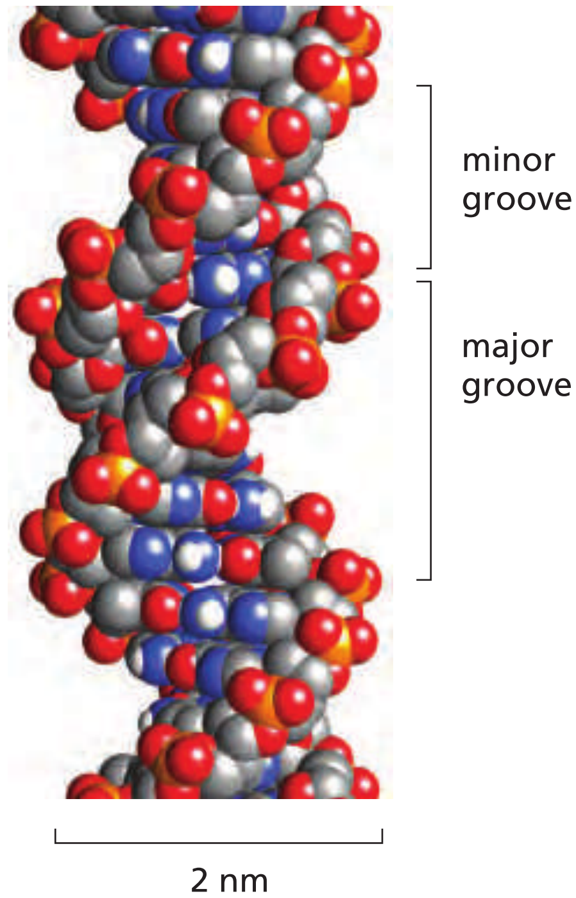{height=500px}
<footnote>Alberts, Molecular biology of the cell, 6ed. pg. 176</footnote>

* DNA is a double-stranded, helical polymer
* Chromosomes are contiguous strands of DNA
* Long strands folded up to take up small space
</div>

## Chromatin across the length scales

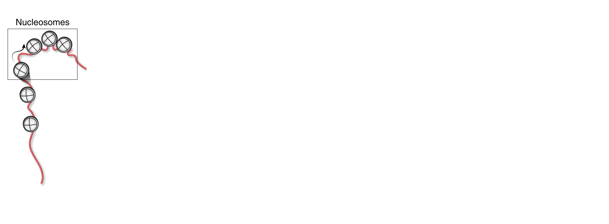

## Chromatin across the length scales

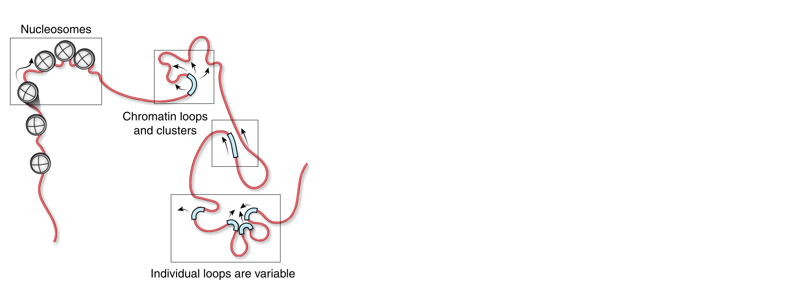

## Chromatin across the length scales

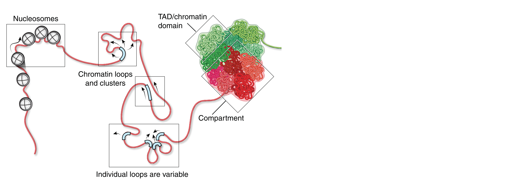

## Chromatin across the length scales

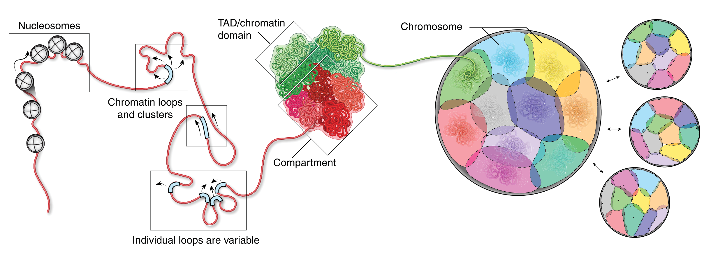

<footnote>Finn & Misteli, Science, 2019, doi:10.1126/science.aaw9498</footnote>

## Regulation of gene expression is partially mediated by chromatin organization

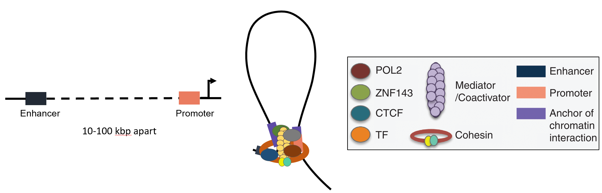
<footnote>Adapted from: Zhou _et al._, Cancer Discovery, 2016, doi:10.1158/2159-8290.CD-16-0745</footnote>

## Hubs of preferential chromatin interaction bring multiple distal regions together

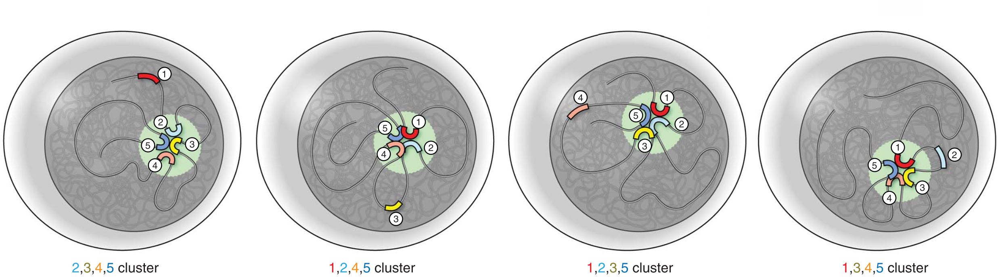
<footnote>Finn & Misteli, Science, 2019, doi:10.1126/science.aaw9498</footnote>

* Hubs are called topologically associated domains (TADs)

## TADs and loops are formed by looping factors

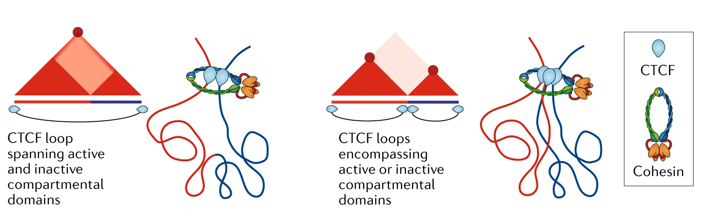
<footnote>Adapted from: Rowley & Corces, Nature Reviews Genetics, 2018, doi:10.1038/s41576-018-0060-8</footnote>

## Current leading model of loop formation: loop extrusion


<footnote>Fudenberg, Abdennur, _et al._, CSH Symposia on Quantitative Biology, 2018, doi:10.1101/sqb.2017.82.034710</footnote>

## Current leading model of loop formation: loop extrusion


<footnote>Ganji _et al._, Science, 2018, doi:10.1126/science.aar7831</footnote>

## Aberrations of chromatin organization can cause disease | Brachydactly and polydactyly

<div class="columns-2">
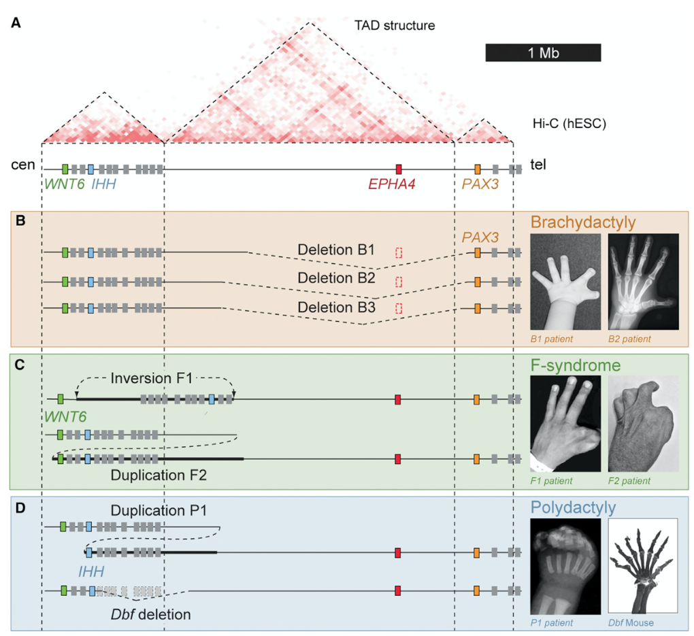{width=500px}
<footnote>Lupianez et al., Cell, 2016. doi:10.1016/j.cell.2016.10.024</footnote>

* Structural variants lead to enhancer hijacking 
* Misregulation in embryogenesis leads to developmental defects

</div>

## Aberrations of chromatin organization can cause disease | Cancer

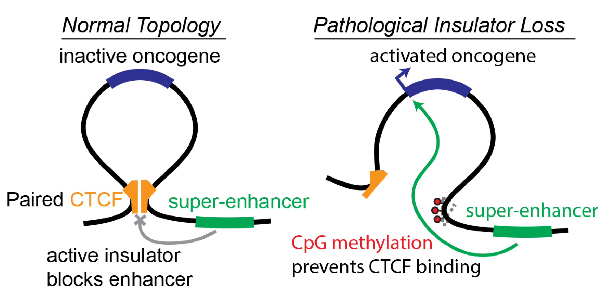{width=400px}
<footnote>Flavahan _et al._, Nature, 2019, doi:10.1038/s41586-019-1668-3</footnote>

* Methylation of CTCF site in SDH-deficient gastro-intestinal stromal tumours
* Methylation blocked CTCF binding
* Enhancer hijacking to express _FGF4_ oncogene

## Measuring chromatin organization

<div class="column-2">
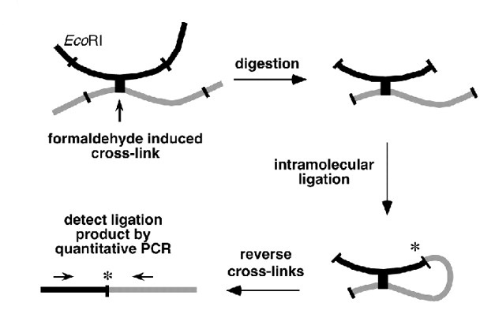{width=400px}
<footnote>Dekker _et al._, Science, 2002, doi:10.1126/science.1067799</footnote>

* Chromosome fixation
* Restriction digest
* Proximity ligation
</div>

## Measure chromatin organization across with genome

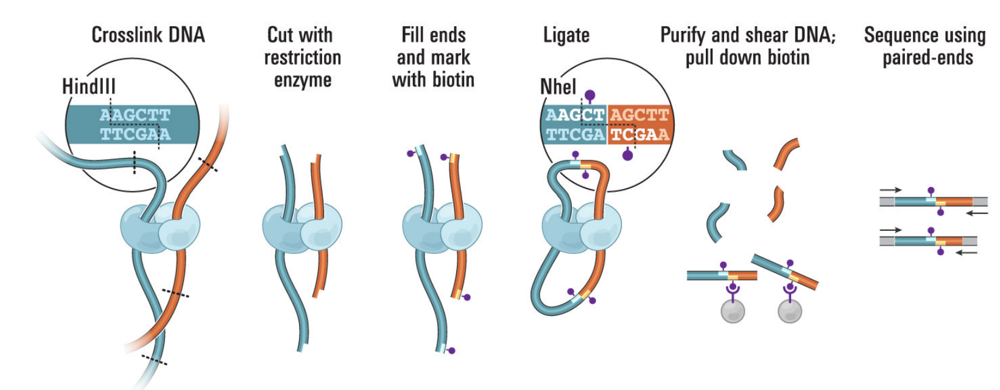
<footnote>Lieberman-Aiden _et al._, Science, 2009, doi:10.1126/science.1181369</footnote>

* Biotinylation for pull down
* Shearing
* Sequencing

## Visualizing interactions

<div class="columns-2">
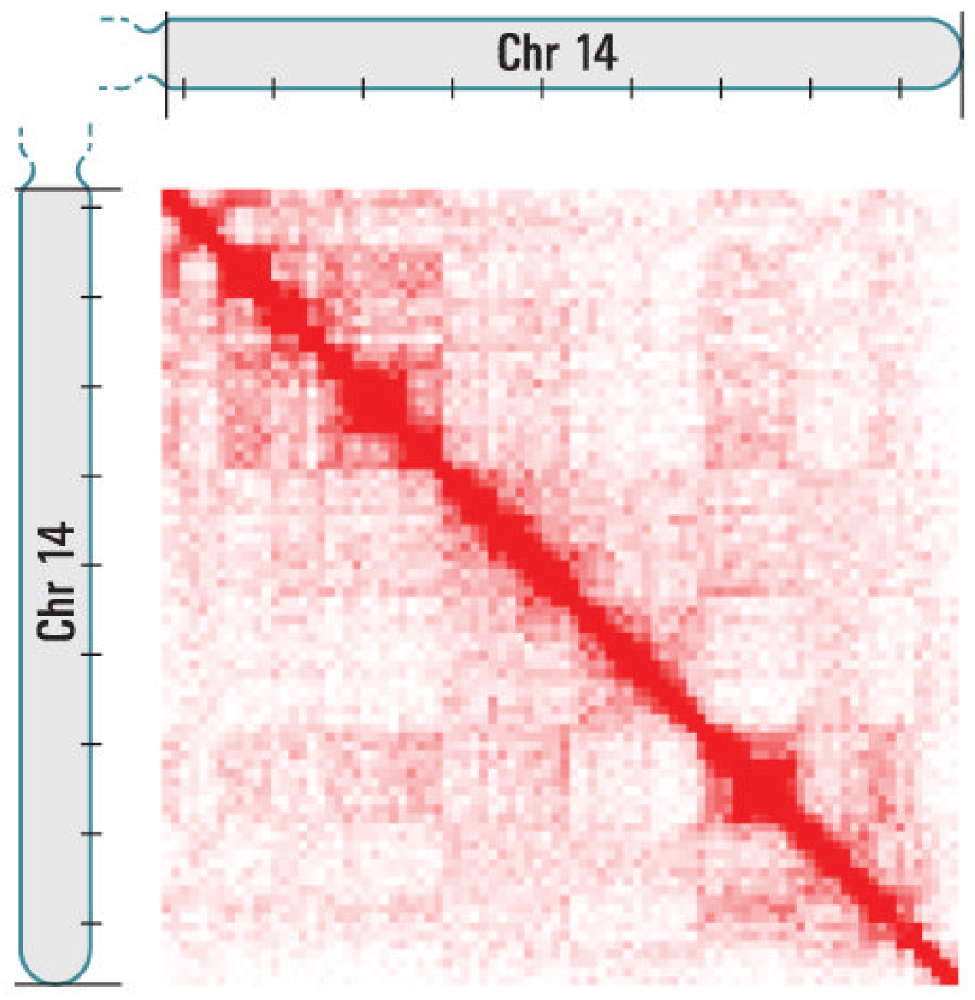{width=450px}
<footnote>Lieberman-Aiden _et al._, Science, 2009, doi:10.1126/science.1181369</footnote>

* Bin genome
* Aggregate reads
* Squares are "preferential hubs"
</div>

## Intra-sample normalization

Biases that exist between bins:

* GC content
* Number of restriction enzyme cut sites
* Mappability

## Intra-sample normalization

<div class="columns-2">
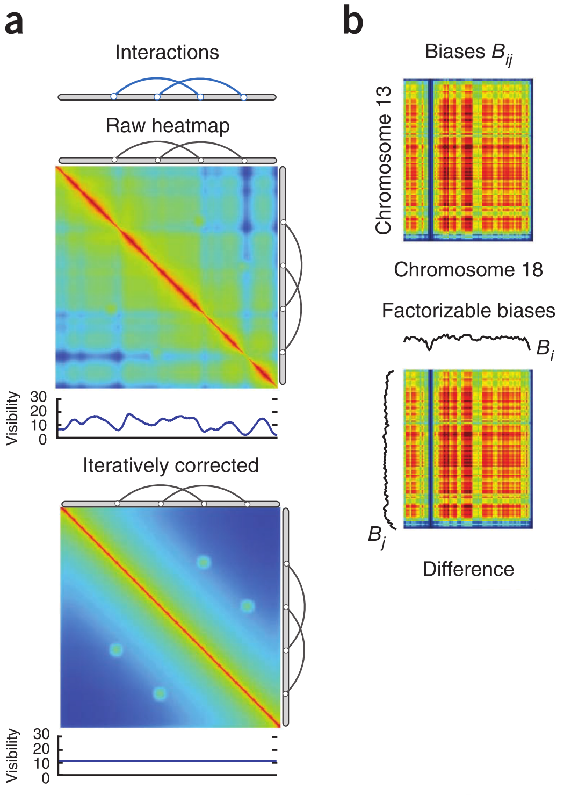{height=500px}
<footnote>Imakaev _et al._, Nature Methods, 2012, doi:10/gdcfmm

* Doubly-stochastic, symmetric matrix
* "Equal visibility" between loci
</div>

## Intra-sample normalization

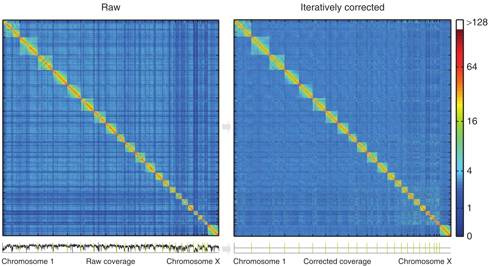{width=800px}
<footnote>Imakaev _et al._, Nature Methods, 2012, doi:10/gdcfmm

## Calling TADs

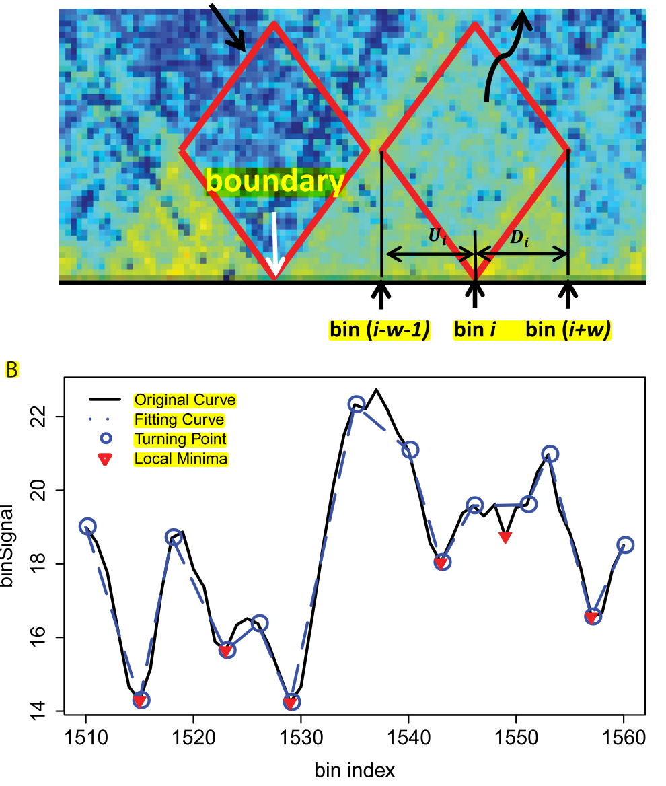{width=400px}
<footnote>Shin, Shi, _et al._, Nucleic Acids Research, 2016, doi:10.1093/nar/gkv1505</footnote>

## Calling Loops | cLoops

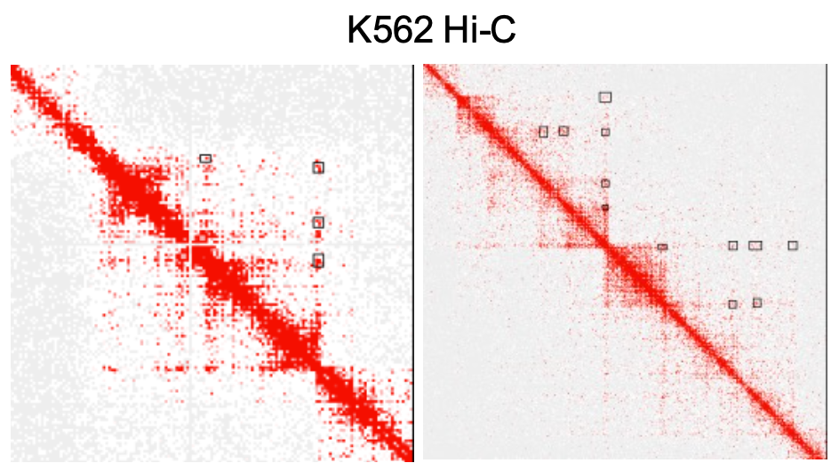
<footnote>Cao, Chen, Chen, Ai, _et al._, Bioinformatics, 2019, doi:10.1093/bioinformatics/btz651</footnote>

## Current methods are still unclear

* Inter-sample normalization is not well-studied
* Almost as many methods as data resource papers
* Lots of similarities and differences from typical genome sequencing

# Break

# Workshop

## Outline | Part 2: Workshop

* Quality control of raw HiC data
* Pre-processing HiC data
* Visualizing with `cooler`

## Workshop

* https://mbp-tech-talks.github.io/2019-2020/08-3d-genome/workshop/

# Summary

## Summary

* Spatial organization of chromatin within cells affects gene regulation
* Measurement by sequencing-based techniques
* Pre-processing tools for HiC data

* https://mbp-tech-talks.github.io/2019-2020/08-3d-genome/

## What I didn't cover

* Microscopy-based measurements
* Compartmentalization
* Changes over cell division
* Single-cell extensions
