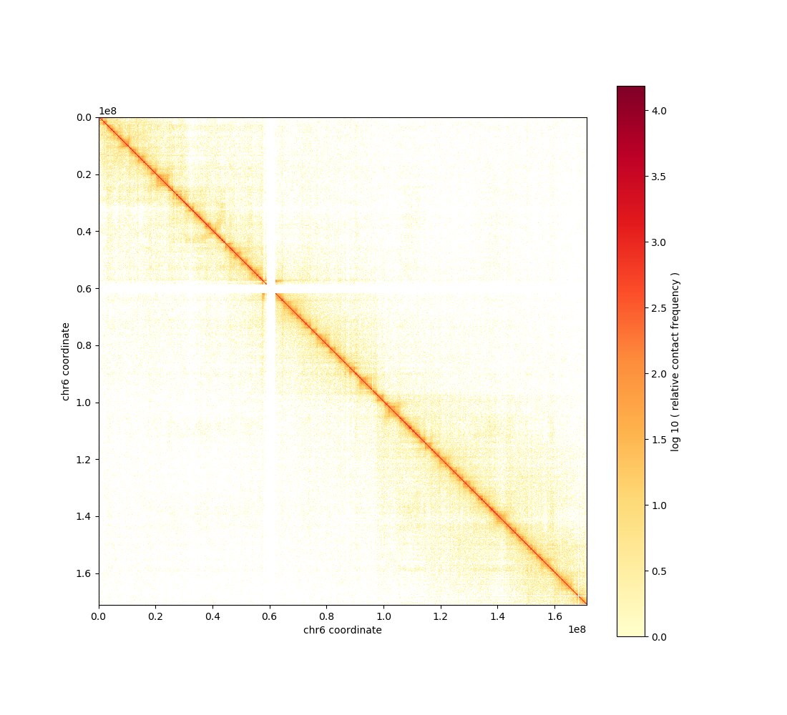
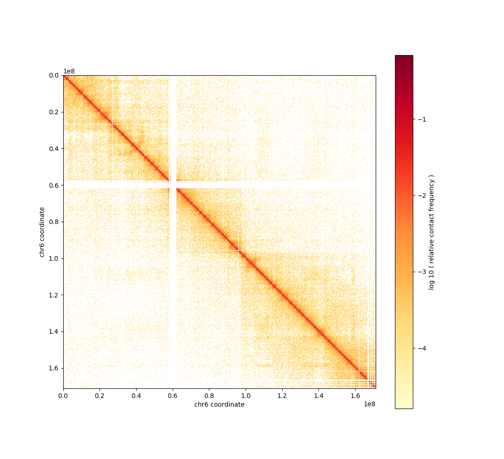

---
---
# Installation

```shell
# using Anaconda environments
conda install cooler matplotlib

# using pip
pip install cooler matplotlib
```

# Data

`22Rv1.hg19.40kbp.txt.gz` contains raw contact counts for chr6 and chr7 of [GSE118629](https://ncbi.nln.gov/geo/GSE118629).
It is stored in a sparse matrix coordinate (COO) format where $M_{i,j} = v$ for each row whose columns are $(i, j, v)$.

# Steps

## Convert raw counts to cooler format

```shell
cooler load --assembly hg19 -f coo --one-based hg19.40kbp.bed 22Rv1.hg19.40kbp.txt.gz 22Rv1.cool
```

## Balance using ICE

```shell
cooler balance 22Rv1.cool
```

## Plot

```shell
cooler show -o chr6.raw.png 22Rv1.cool chr6
cooler show -b -o chr6.balanced.png 22Rv1.cool chr6
```





# Interactive exploration with Higlass


