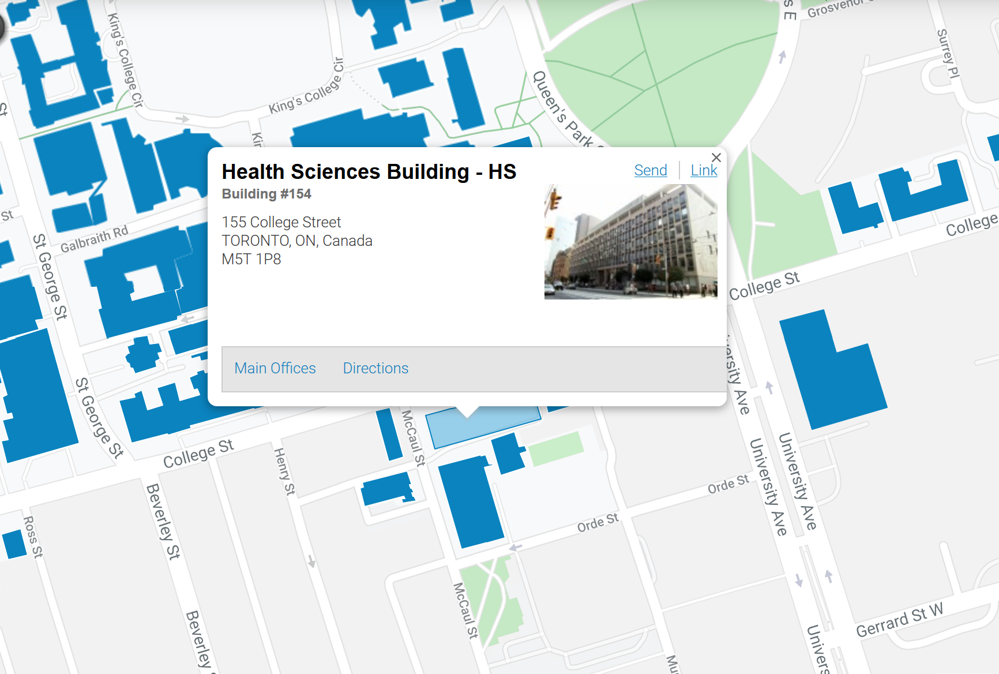

---
---

# 2019 - 2020 Tech Talks

Here you can find all the presentations for the 2019-2020 academic year.

## Presentations

* [01 - DNA Sequencing (James Hawley)](/2019-2020/01-dna-sequencing/)
* [02 - Sequence Alignment (James Hawley)](/2019-2020/02-sequence-alignment/)
* [03 - Detecting mutations in DNA sequencing data (Jeff Bruce)](/2019-2020/03-mutation-detection/mutation-detection_jeff-bruce.pdf)
  * [Additional scripts](https://github.com/MBP-Tech-Talks/MBP-Tech-Talks.github.io/tree/master/2019-2020/03-mutation-detection)
* [04 - Introduction to proteomics (Amanda Khoo)](/2019-2020/04-intro-proteomics/intro-proteomics_amanda-khoo.pdf)
  * [Additional scripts](https://github.com/MBP-Tech-Talks/MBP-Tech-Talks.github.io/tree/master/2019-2020/04-intro-proteomics)
* [05 - RNA sequencing analysis (Musa Ahmed)](/2019-2020/05-rna-seq/rna-seq_musa-ahmed.pdf)
  * [Additional scripts](https://github.com/MBP-Tech-Talks/MBP-Tech-Talks.github.io/tree/master/2019-2020/05-rna-seq)
* [06 - DNA methylation analysis (Mehran Karimzadeh)](/2019-2020/06-dna-methylation/)
  * [Additional scripts](https://github.com/MBP-Tech-Talks/MBP-Tech-Talks.github.io/tree/master/2019-2020/06-dna-methylation)
  * [Installation notes for workshop](installation-notes/)
* [07 - Proteo-genomics analysis (Lydia Liu)](/2019-2020/07-intro-proteogenomics/intro-proteomics_lydia-liu.pdf)
* 08 - Chromosome conformation capture and the 3D genome (James Hawley)

Links to presentations will be added after the seminar.

## For presenters

* Presentations are in [HSB 100](http://map.utoronto.ca/building/154) (155 College Street, right of the elevators, by the women's washroom)
* Room is booked from 12:00 to 14:00 on Fridays
  * Please show up ahead of time to minimize setup time
* There is a teaching station with a projector and blackboard

