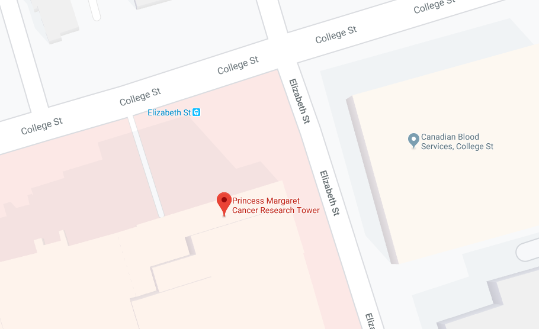

---
---

# 2019 - 2020 Tech Talks

Here you can find all the presentations for the 2019-2020 academic year.

## Presentations

### Fall 2019

| Session | Date       | Title | Presenter | RSVP | Slides | Workshop |
| ------- | ---------- | ----- | --------- | ---- | ------ | -------- |
| 01      | 2019-10-04 | DNA Sequencing | James Hawley |  | [Slides](/2019-2020/01-dna-sequencing/) | |
| 02      | 2019-10-18 | Sequence Alignment | James Hawley | | [Slides](/2019-2020/02-sequence-alignment/) | |
| 03      | 2019-11-01 | Detecting mutations in DNA sequencing data | Jeff Bruce | | [Slides](/2019-2020/03-mutation-detection/mutation-detection_jeff-bruce.pdf) | [Additional scripts](https://github.com/MBP-Tech-Talks/MBP-Tech-Talks.github.io/tree/master/2019-2020/03-mutation-detection) |
| 04      | 2019-11-08 | Introduction to proteomics | Amanda Khoo | | [Slides](/2019-2020/04-intro-proteomics/intro-proteomics_amanda-khoo.pdf) |[Additional scripts](https://github.com/MBP-Tech-Talks/MBP-Tech-Talks.github.io/tree/master/2019-2020/04-intro-proteomics) |
| 05      | 2019-11-15 | RNA sequencing analysis | Musa Ahmed | | [Slides](/2019-2020/05-rna-seq/rna-seq_musa-ahmed.pdf) | [Additional scripts](https://github.com/MBP-Tech-Talks/MBP-Tech-Talks.github.io/tree/master/2019-2020/05-rna-seq) |
| 06      | 2019-11-22 | DNA methylation analysis | Mehran Karimzadeh | | [Slides](/2019-2020/06-dna-methylation/) | [Additional scripts](https://github.com/MBP-Tech-Talks/MBP-Tech-Talks.github.io/tree/master/2019-2020/06-dna-methylation), [Installation notes for workshop](installation-notes/) |
| 07      | 2019-11-29 | Proteo-genomics analysis | Lydia Liu | | [Slides](/2019-2020/07-intro-proteogenomics/intro-proteomics_lydia-liu.pdf) | |
| 08      | 2019-12-06 | Chromosome conformation capture and the 3D genome | James Hawley | | [Slides](/2019-2020/08-3d-genome/) | [Workshop](/2019-2020/08-3d-genome/workshop/) |

### Winter 2020

| Session | Date       | Title | Presenter | RSVP | Slides | Workshop |
| ------- | ---------- | ----- | --------- | ---- | ------ | -------- |
| 09      | 2020-01-27 | Introduction to machine learning | Davide Chicco | | | |
| 10      | 2020-02-03 | GPU speedups in Python with Cupy, Numba, and pycuda | Geoff Woollard | | | |
| 11      | 2020-02-10 | Medical image processing in Python | Michal Kazmierski | | | |

Links to presentations will be added after the seminar.

## For presenters

* Presentations are in [PMCRT Room 4-204](https://www.google.ca/maps/place/Toronto+Medical+Discovery+Tower/@43.6599045,-79.3881754,19.2z/data=!4m5!3m4!1s0x882b34b63e7fb161:0x5b92260a8a6360a9!8m2!3d43.6597878!4d-79.3875671) (101 College Street, East Tower, 4th floor conference room)
* Room is booked from 11:00 to 13:00 on Mondays
  * Please show up ahead of time to minimize setup time
* There is a podium with a projector (HDMI/VGA input) and whiteboard

